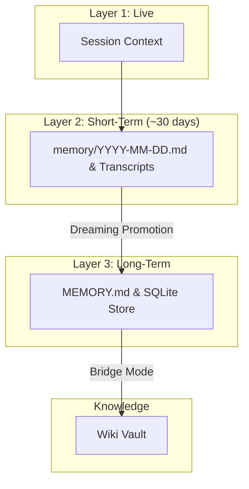
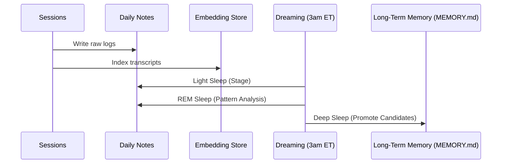

# OpenClaw Memory Stack

This repository contains the `memory-agent-primer` skill, providing an onboarding and operational guide for maintaining OpenClaw's advanced memory subsystem.

## Overview
As the memory overseer, this toolset allows you to:
- Monitor memory health.
- Curate long-term facts in `MEMORY.md`.
- Oversee dreaming cycles.
- Maintain cross-session recall quality.

## Architecture
The memory subsystem utilizes a three-layer architecture to handle short-term logs, structured knowledge, and long-term curated facts.



## Data Flow
The system processes information through a defined pipeline to ensure high-confidence recall.



## Key Configuration

### Memory Search Settings
Configured in `agents.defaults.memorySearch`:
```json
{
  "provider": "local",
  "experimental": { "sessionMemory": true },
  "query": {
    "hybrid": {
      "enabled": true,
      "mmr": { "enabled": true, "lambda": 0.7 },
      "temporalDecay": { "enabled": true, "halfLifeDays": 30 }
    }
  }
}
```

### Dreaming Configuration
Configured in `plugins.entries.memory-core.config.dreaming`:
```json
{
  "enabled": true,
  "frequency": "0 3 * * *",
  "timezone": "America/New_York"
}
```

## Structure
- `SKILL.md`: Skill definition and entry point.
- `assets/`: Configuration patches for various memory modes.
- `scripts/`: Automation for health checks, reindexing, and promotion management.
- `references/`: Documentation on architecture, tuning, and workflows.

## Getting Started
For comprehensive setup and operational instructions, please refer to the `references/primer.md` file within this repository.
